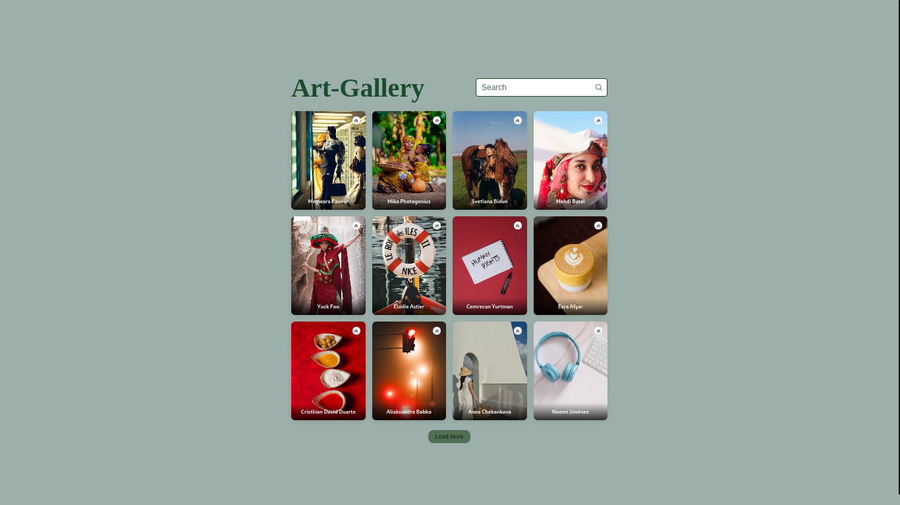

# Description

_Papers Web-App with made up of reactjs uses Pexel api to deliver high-quality wallpaper content. The website offers a wide variety of wallpapers for users to choose from, and the content is updated regularly. Additionally, the website has all the features that are necessary to be a successful wallpaper website. This includes an easy navigation system, high-quality images, and a user-friendly interface._




# Clone and Use
- The website is completely built on react-js library of javascript and that's why we need nodejs and npm installed
- While installing nodejs and npm, try to install versions which are equal or greater than the versions mentioned in badges above
- In case you want to help developing it or simply saving it, you can fork the repository just by clicking the button on the top-right corner of this page
- After the successful installation of nodejs and npm, clone the repository into your local system using below command:
 ```bash
 git clone https://github.com/SauRavRwT/Wallpaper-App.git
 ```
- To download required dependencies to your system, navigate to the directory where the cloned repository resides and execute following command:
  ```node
  npm install
  ```
- Now the project is ready to use
- You can check it using `npm start`, it will open the website locally on your browser.

### `npm start`

Runs the app in the development mode.\
Open [http://localhost:3000](http://localhost:3000) to view it in your browser.

The page will reload when you make changes.\
You may also see any lint errors in the console.

### Things need to know

_API key -_

you get it from [pexels](https://www.pexels.com/api/new/)
```js
    const API_KEY = "YOUR_API_KEY";
```

### `npm run build`

Builds the app for production to the `build` folder.\
It correctly bundles React in production mode and optimizes the build for the best performance.

The build is minified and the filenames include the hashes.\
Your app is ready to be deployed!