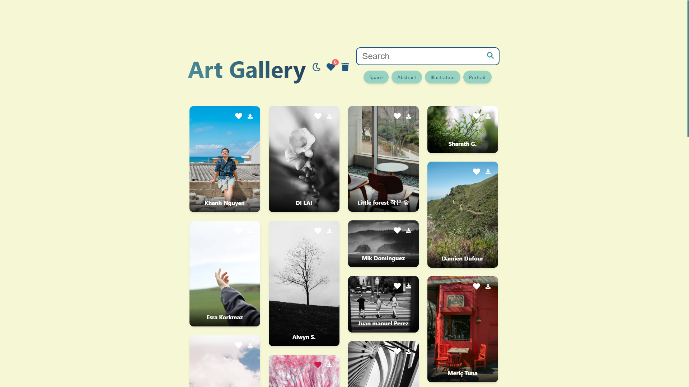
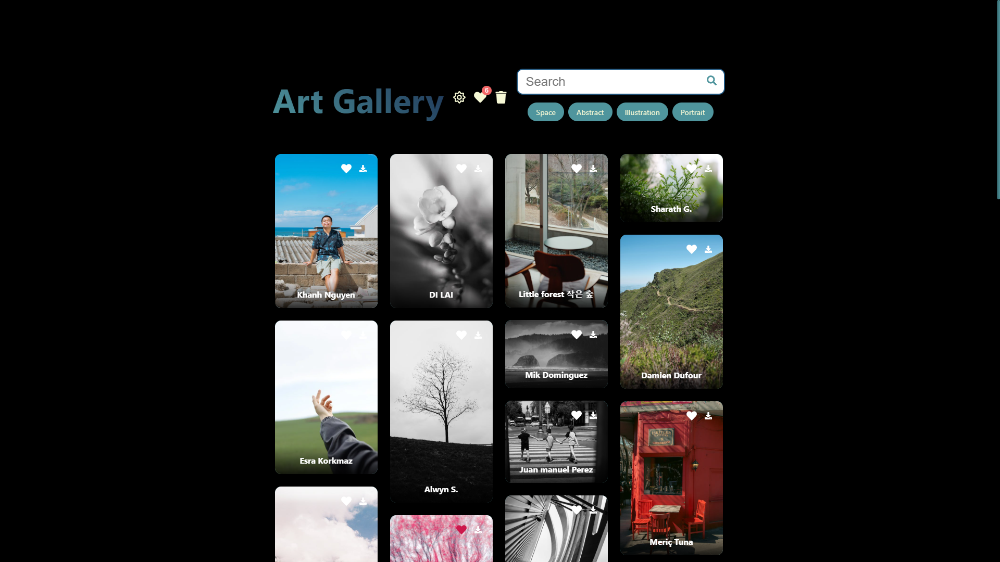
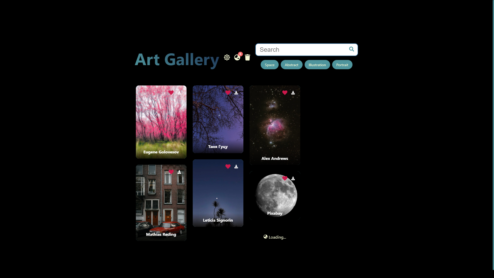
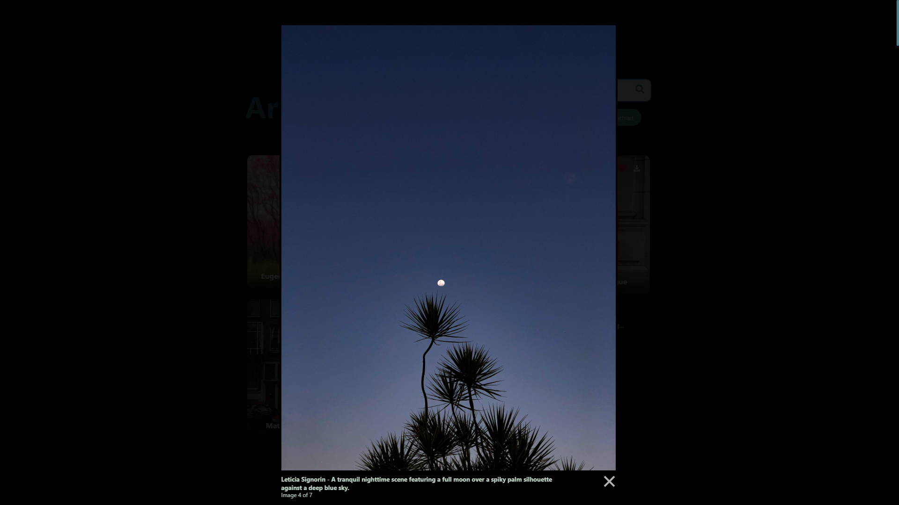

# Art-Gallery



## Overview
Art-Gallery is a modern web application built with React.js that provides high-quality wallArt-Gallery using the Pexels API. The application offers:

- High-quality wallpaper collection.
- Regularly updated content.
- Easy navigation system.
- User-friendly interface.

## Features

- Smart Search with Recent Searches (persisted in localStorage).
- Clear cache buttons.
- Advanced Caching System (1-hour duration).
- Elegant Preloader Animation.
- Responsive Design with Modern UI.
- Infinite Scroll with Intersection Observer.
- Lightbox Image Preview.
- Direct High-Resolution Image Download.
- Search History Pills.
- Suggustions in pills.
- Performance Optimizations with React Hooks.

## Preview



## Installation

### Prerequisites
- Node.js
- npm (Node Package Manager)

### Setup Instructions

1. **Clone the repository**
```bash
git clone https://github.com/SauRavRwT/Wallpaper-App.git
```

2. **Install dependencies**
```bash
cd Wallpaper-App
npm install
```

3. **Configure API Key**
- Get your API key from [Pexels](https://www.pexels.com/api/key/)
- Add your API key in the project:
```javascript
const API_KEY = "YOUR_API_KEY";
```

4. **Run the application**
```bash
npm start
```
The application will open at [http://localhost:3000](http://localhost:3000)

## Development

### Available Scripts

- `npm start` - Runs the app in development mode
- `npm run build` - Creates a production build in the `build` folder

## Contributing

We welcome contributions! If you’d like to help improve this project, feel free to fork the repository and submit a Pull Request.
